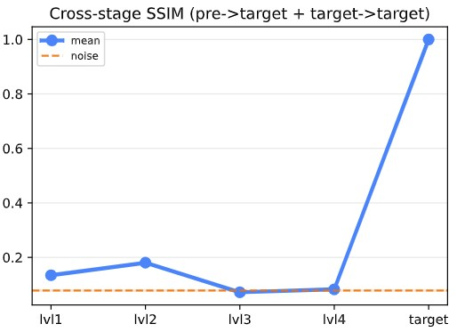
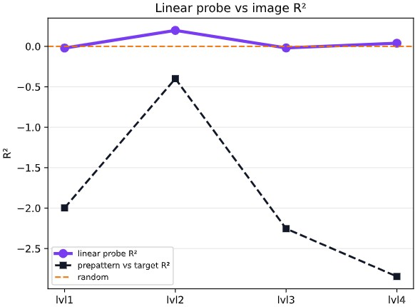

# Explanations for the figures
### aka a recap for what we discussed last
#### Hej Milton :)
I should maybe have made folders, but I'll go through them in groups by filename/title:

## Metric 1 (Similarity)


#### "Cross stage"_
This mean that we are looking at different levels of pre-patterning and comapring them to their final target

#### "internal_cohort"_
This is what I showed you and Elias last time. Each pair of prepatterns is compared to each other.


#### \_"NMI"\_
Normalized Mutial Information. 
This is the first thing I implemented, and it is not the best, but it can serve as a base for explaining the others.
Here, w 

#### \_"fourier_NMI"\_
Same as above, but on the magnitudes of a 2d fourier transfrom of the images

#### \_"ssim"\_
Structured Similarity Index Measure. What a an *index measure* is compared to an *index* or a *measure* is still unknown.

#### \_"traj"\_ or \_"mean"\_
We have `_traj` and `_mean`. The first of wich also contains every individual trajectory. No change in calculations.

And finally:
#### \_"with_target" or \_"without_target"
Also no change in calculations. Just whether the calculations are also done on the target emoji as a sanity-check / baseline. Uglier plots, but I liked having the reference value.

## Metric 2 (Pixelwise Probe)

#### "linear"_ or "nonlinear"_
I mean, self-explanatory. I originally made a pixel-wise linear thingamajig, but one of you said comparing to a more complex would be interesting. Call me if you need me to reexplain how this worked :)

The y-axis is the R^2 between the transformed image and the target.

#### \_"with_prepattern"\_ or \_"without_prepattern"\_
Again, no change in the calculation. The one "with" simply includes the R^2 between the non-transformed prepattern and the target

### ps
If you want me to sort through this myself (ie. offload some work) jsut tell me - I just wanted to give you the ability to pick-and-choose for yourself.

``` 
Best,
Jakob 
```
## end of communication