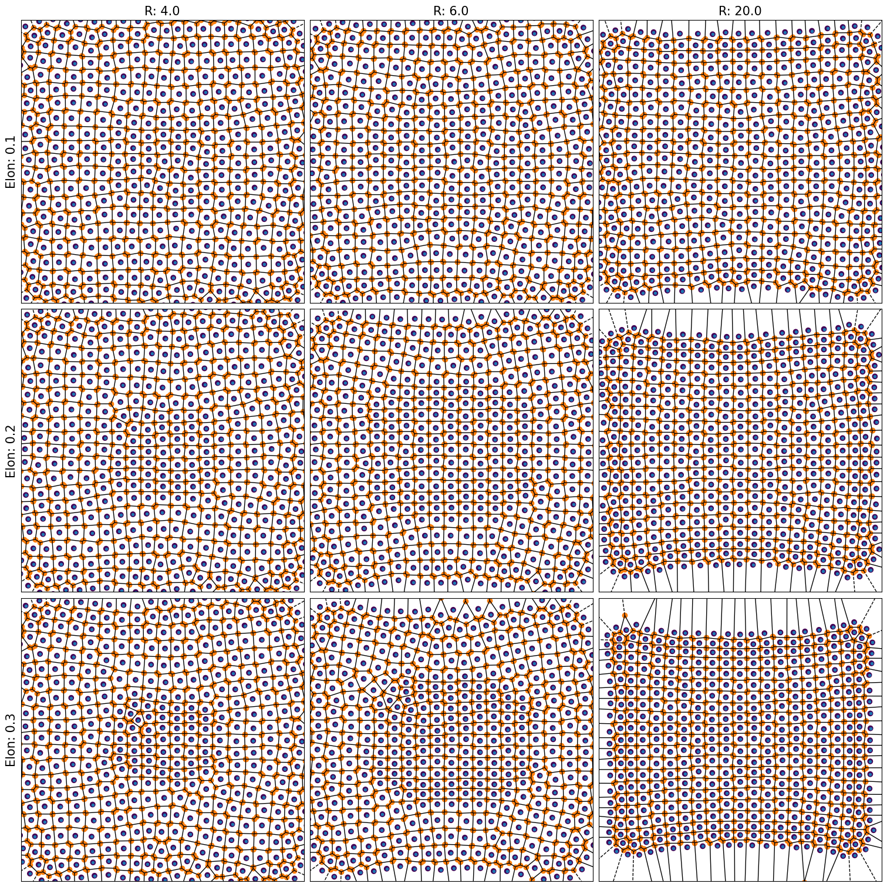
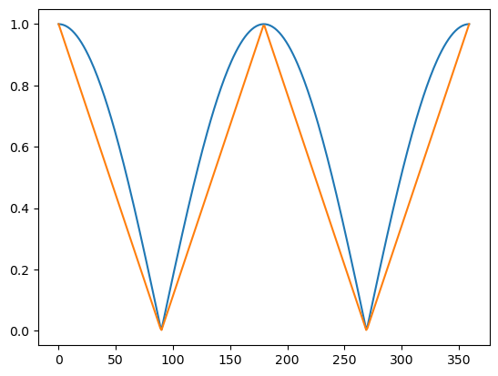
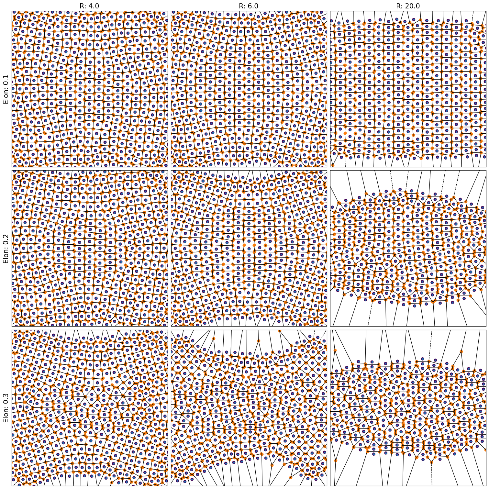
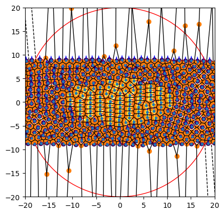
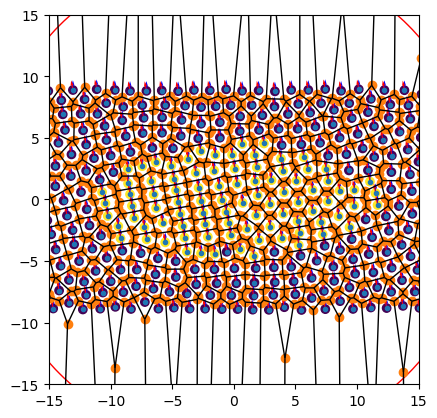

10/12-2024
We have implemented a way of doing elongated cells.

describe

13/12-2024
It seems that squeezing (i.e. being thinner) is more stable than extending. This can be seen here:

Not sure what to make of this.

16/12-2024

Ahhh! I fell victim to one of the classic blunders! The first of which is never going into a land war in Asia, the second of which is assuming the dot product between uniformly distributed vectors is uniform.

It now works better!

17/12-2024

Okay! 

It seems like my dream of adding somewthing worthwile to the model is inching closer.

The added "elongation factor" works like a charm when added to the potential and minimized ($\frac{dV}{de})$ alongside the rest of the parameters (r, p, q)

For a slowly squeezing (in the y-axis) potential, the cells behave like this: 

As a

Why works

Next step w lambda2 

Also works!

