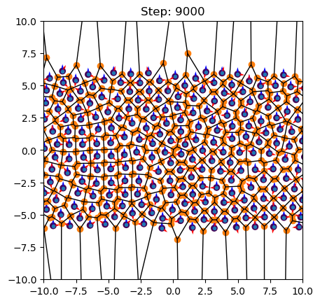
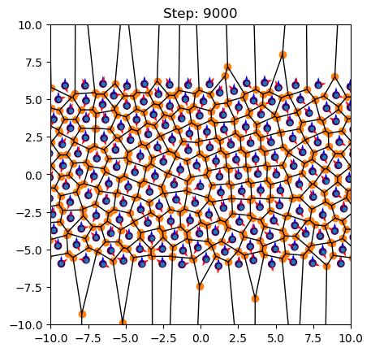
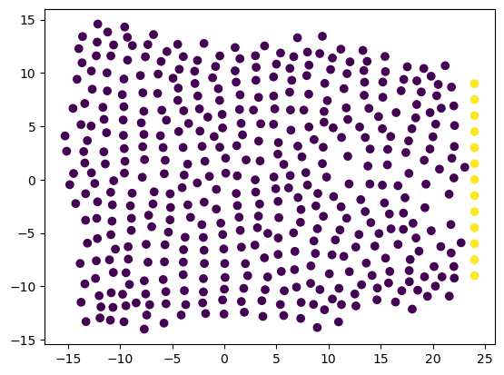
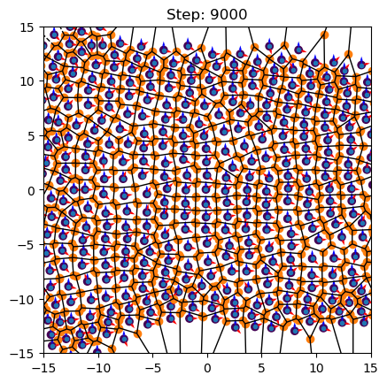
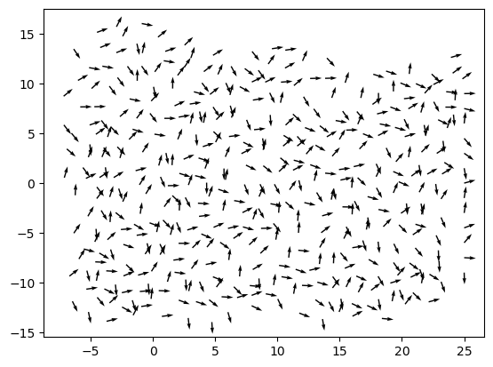
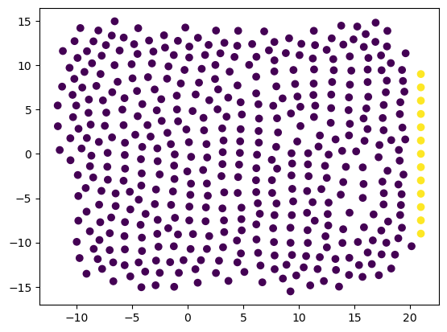
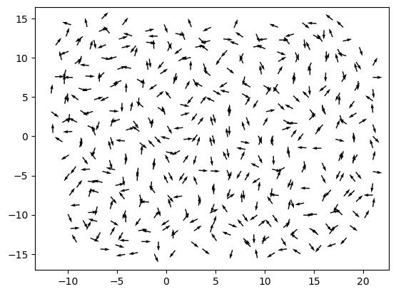
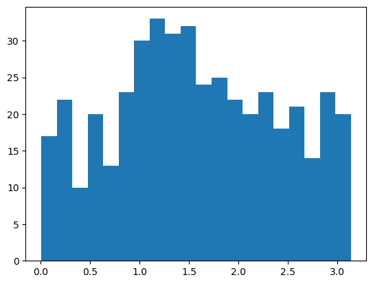

10/12-2024
We have implemented a way of doing elongated cells.

By introducing the tentatively named parameter  _e_.

For a given elongated cell, it "tricks" itself and its neighbors by changing their percieved inter-cell distance according to the internal angle between their positions and average PCP-vector:

$$\alpha = \cos^{-1}\left(\left|\hat{r}_{ij}\cdot\hat{\langle q\rangle}\right|\right)/(\pi/2)$$ 

This is then multiplied on their inter-cell distance that is used in the potential:

$$\tilde{r}_{ij}=r_{ij}\cdotΗ(\alpha)$$

The potential now looks like this:

$$e^{-\tilde{r}_{ij}}-S(r_{ij})e^{-\tilde{r}_{ij}/\beta}$$

Which gives the new equilibrium distance $\tilde{r}_{eq}=r_{eq}/Η(\alpha)$

Now, $H(\alpha)$ is a function that goes from $1-e$ to $1+e$ according to the angle ($\alpha$) between their in-plane axis (_q_) and distance vector ($r_{ij}$) 
$$H(\alpha)=1 + (2\cdot f(\alpha) - 1)\cdot e$$

_f_ is an "easing function" (think activation function in machine learning) that defined 

For future refence - this formulation ($1-e$ to $1+e$) changes the area. We need to come up with something better.

13/12-2024
It seems that squeezing (i.e. being thinner) is more stable than extending. This can be seen here:

Not sure what to make of this.

16/12-2024

Ahhh! I fell victim to one of the classic blunders! The first of which is never going into a land war in Asia, the second of which is assuming the dot product between uniformly distributed vectors is uniform.

It now works better!

I Think we might have a stable way of doing in-plane anisotropy.

17/12-2024

Okay! 

It seems like my dream of adding somewthing worthwile to the model is inching closer.

The added "elongation factor" works like a charm when added to the potential and minimized $(\frac{dV}{de})$. The rest of the parameters (p, q) are kept constant.

For a slowly squeezing (in the y-axis) potential, the cells behave like this: 

Next step is trying with the q's also affected by lambda2. 

Okay, a lot happens today - that also works!

Trying with no lambda2 does not automatically make them align (even tried making the dot product into something tanh-like) but it makes these rosette-looking things:

Wait a minute it orients the q's when elongation is clamped within (-0.5,0.5)!

(note to self _some_ aligning (albeit only locally)  also occur when no pressure is applied. We need some sort of metric! )

Now I will try pulling.

18/12-2024

Truly on a roll. Pulling also works - we have PCP-aligning in wound healing out of the box!

    

it still does some of the rosette'ing (even when I clamp it harder) Will investigate.

I am sad that the area is not conserved, so I am testing new formulations. 

...

Okay

$$H(\alpha)=k^{\alpha*e}$$

Complies with area conservation (if we assume approximately rectangular cells) and still has all of the above qualities. But it seems somehow less... stable?

Heres some pulling:

And some aggregate statistics on their angles wrt. horizontal

